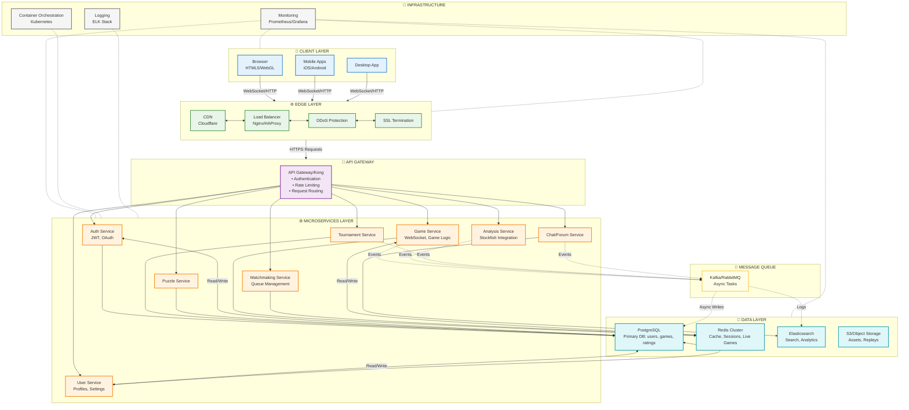

# Задание 1. Клиент-серверная архитектура

## 1.1 Трехзвенная и многозвенная клиент-серверная архитектура: основные компоненты и их назначение.

### Трехзвенная(трехуровневая) клиент-серверная архитектура.

#### Схема взаимодействия

**[Клиент] <-> [Сервер приложений] <-> [Сервер данных]**

1. Клиент \ Клиентский уровень

- Роль: Инициатор запросов, точка входа пользователя
- Компоненты: Браузер, мобильное приложение, толстый\тонкий клиент
- Назначение:
    - отображение интерфейса
    - Формирование HTTP/API-запросов
    - Предварительная валидация ввода
- Взаимодействие: Общается только с сервером приложение (не с БД напрямую)

2. Сервер приложения

- Роль: <<Мозг>> системы, посредник между клиентом и данными
- Компоненты: Веб-сервер (Nginx/Apache), бэкенд-сервисы (Node.js, Java, .NET), API-шлюз
- Назначение:
    - Обработка бизнес-правил и логики
    - Аутентификация и авторизация
    - Формирование запросов к БД
    - Кэширование, балансировка, логирование
- Взаимодействие: Принимает запросы от клиентов, обращается к серверу данных

3. Сервер данных (Data tier)

- Роль: Надёжное хранение и предоставлние данных
- Компоненты: СУБД (PostgreSQL, MySQL, MongoDB), кэш-серверы (Redis), файловые хранилиза
- Назначение:
    - Выполнение CRUD-операций
    - Транзакции, целостность, репликация
    - Оптимизация запросов, индексы
- Взаимодействие: Отвечает только на запросы сервера приложений

#### Ключевые принципы трехуровневой клиент-серверной модели:

- Строгая иерархия: Клиент -> Приложение -> Данные (обратный поток только для ответов)
- Изоляция ответственности: Каждый уровень решает свою задачу, не пересекаясь с другими
- Единая точка входа: Клиент не знает о структуре БД, работает только через API
- Централизированная логика: Бизнес-правила хранятся и выполняются на сервере, а не на клиенте

*В чистом клиент-серверном варианте все три уровня физически разделены - это обеспечивает безопасность, масштабируемость и независимое развитие компонентов.*

### Многоуровневая клиент-серверная архитектура (N-Tier)

#### Общая схема

**[Клиент] <-> [Web/API Gateway] <-> [Сервисы логики] <-> [Кэш/Очереди] <-> [Сервер данных]**

1. Клиент

- Компоненты: Браузер, мобильное приложение, Desktop-клиент
- Назначение: Представление интерфейа, отправка запросов, локлаьная валидация

2. Шлюз\Балансировщик

- Компоненты: Nginx, Api Gateway, Load Balancer
- Назначение: Маршрутизация, запросов, SSL-терминация, rate limiting, аутентификация на входе

3. Бизнес-логика

- Компоненты: Микросервисы, REST/gRPC API, фоновые воркеры
- Назначение: Обработка правил приложения, координация операций, интеграция с внешними системами

4. Кэш и очереди

- Компоненты: Redis, Memcached, Kafka, RabbitMQ
- Назначение: Ускорение ответов, асихронная обработка, буферизация пиковых нагрузок

5. Данные

- Компоненты: СУБД (PostgreSQL, MySQL), NoSQL, объектные хранилища
- Назначение: Надёжное хранение, транзакции, репликация, резервное копирование

6. Инфракструктурный

Компоненты: Мониторинг (Prometheus), логирование (ELK), CI/CD
Назначение: Наблюдаемость, отладка, автоматизация развёртывания

#### Ключевые принципы

- Разделение ответственности: каждый уровень решает одну задачу
- Слабая связанность: уровни общаются через чёткие интерфейсы (API, протоколы)
- Горизонтальная масштабируемость: любой уровень можно масштабировать независимое
- Отказоустойчивость: дублирование компонентов, health checks, graceful degradation
- Безопасность по периметру: клиент не имеет прямого доступа к БД, все запросы проходят через контролируемые шлюзы

Когда применять: Высокие нагрузки, множество пользователей, частый изменения бизнес-логики, требования к отказоустойчивости и масштабируемости, команда из нескольких разработчиков/групп

*Многоуровневая архитектура - это не про количество серверов, а про логическое разделение ответственности. Физически несколько уровней могут размещаться на одном сервере, но логически они должны оставаться изолированными.*

## 1.2 <Блок схема архитектуры приложения [Lichess](lichess.org)>



## 1.3 Выделить 4 ключевых компонента и подписать назначения каждого компонента.


```mermaid

flowchart TB
subgraph CLIENT["🖥️ КОМПОНЕНТ 1: КЛИЕНТСКИЙ УРОВЕНЬ"]
        direction TB
        C1["Browser<br/>(HTML5/WebGL)"]
        C2["Mobile Apps"]
        C3["Desktop App"]
        CLIENT_DESC["<b>Назначение:</b><br/>• Отображение игрового интерфейса<br/>• Отправка ходов игрока<br/>• Получение обновлений в реальном времени<br/>• WebSocket-соединение с сервером"]
    end

    subgraph EDGE["🌐 КОМПОНЕНТ 2: ПОГРАНИЧНЫЙ УРОВЕНЬ И API GATEWAY"]
        direction TB
        E1["Load Balancer<br/>(Nginx)"]
        E2["CDN<br/>(Cloudflare)"]
        E3["API Gateway<br/>(Kong)"]
        EDGE_DESC["<b>Назначение:</b><br/>• Распределение нагрузки между серверами<br/>• Защита от DDoS-атак<br/>• Аутентификация запросов<br/>• Маршрутизация к нужным сервисам<br/>• Rate Limiting (ограничение запросов)"]
    end

    subgraph MICROSERVICES["⚙️ КОМПОНЕНТ 3: МИКРОСЕРВИСЫ"]
        direction TB
        M1["Game Service<br/>(WebSocket Server)"]
        M2["Matchmaking Service"]
        M3["User Service"]
        M4["Analysis Service"]
        M5["Tournament Service"]
        MICRO_DESC["<b>Назначение:</b><br/>• Game Service: обработка ходов, валидация,<br/>синхронизация состояния доски<br/>• Matchmaking: поиск соперников по рейтингу<br/>• User Service: профили, настройки<br/>• Analysis: анализ партий (Stockfish)<br/>• Tournament: управление турнирами"]
    end

    subgraph DATA["💾 КОМПОНЕНТ 4: УРОВЕНЬ ДАННЫХ"]
        direction TB
        D1["PostgreSQL<br/>(Primary Database)"]
        D2["Redis Cluster<br/>(Cache & Sessions)"]
        D3["Elasticsearch<br/>(Search & Analytics)"]
        DATA_DESC["<b>Назначение:</b><br/>• PostgreSQL: хранение пользователей,<br/>партий, рейтингов (постоянное хранилище)<br/>• Redis: кэш, активные сессии,<br/>текущие игры (быстрый доступ)<br/>• Elasticsearch: полнотекстовый поиск,<br/>аналитика и статистика"]
    end

    %% Connections
    C1 & C2 & C3 -->|WebSocket/HTTPS| EDGE
    E3 --> M1 & M2 & M3 & M4 & M5
    M1 <-->|"Read/Write"| D2
    M2 <-->|"Read/Write"| D2
    M3 <-->|"Read/Write"| D1
    M4 --> D1
    M5 --> D1
    M1 -.->|Events| D3
    
    %% Component descriptions
    CLIENT_DESC -.-> CLIENT
    EDGE_DESC -.-> EDGE
    MICRO_DESC -.-> MICROSERVICES
    DATA_DESC -.-> DATA

    %% Styling
    classDef client fill:#e3f2fd,stroke:#1976d2,stroke-width:3px,color:#000
    classDef edge fill:#e8f5e9,stroke:#388e3c,stroke-width:3px,color:#000
    classDef micro fill:#fff3e0,stroke:#f57c00,stroke-width:3px,color:#000
    classDef data fill:#e0f7fa,stroke:#0097a7,stroke-width:3px,color:#000
    classDef desc fill:#fff9c4,stroke:#fbc02d,stroke-width:2px,stroke-dasharray: 5 5,color:#000

    class C1,C2,C3 client
    class E1,E2,E3 edge
    class M1,M2,M3,M4,M5 micro
    class D1,D2,D3 data
    class CLIENT_DESC,EDGE_DESC,MICRO_DESC,DATA_DESC desc

 ```

## 1.4 Связать компоненты с практикой реального компоненты

| Компонент архитектуры | 1 - 2 наиболее вероятных типа сбоя для этого компонента | Как этот сбой проявляется для конечного пользователя | Тип нефункционального тестирования, который наиболее релевантен для проверки устойчивости системы к данному сбою |
|---|---|---|---|
| **1. Клиентский уровень**<br>(Browser, Mobile Apps, Desktop App) | • Разрыв WebSocket-соединения<br>• Проблемы совместимости браузеров/устройств | • Игра «зависает», ходы не отображаются в реальном времени<br>• Интерфейс работает некорректно или не отображается на определённых устройствах | **Compatibility Testing** (тестирование совместимости)<br>**Network Resilience Testing** (тестирование устойчивости к сетевым проблемам) |
| **2. Пограничный уровень и API Gateway**<br>(Load Balancer, CDN, API Gateway) | • Перегрузка балансировщика нагрузки<br>• DDoS-атака или превышение rate limit | • Пользователь не может подключиться к сервису (таймауты, ошибки 503)<br>• Критически медленная загрузка страницы или API-ответов | **Load Testing** (нагрузочное тестирование)<br>**Stress Testing** (стресс-тестирование)<br>**Security Testing** (тестирование на устойчивость к DDoS) |
| **3. Микросервисы**<br>(Game Service, Matchmaking, User Service и др.) | • Падение отдельного сервиса<br>• Проблемы межсервисной коммуникации | • Невозможно найти соперника<br>• Ходы не валидируются, игра не синхронизируется<br>• Противоречивое состояние игры у игроков | **Resilience Testing** (тестирование отказоустойчивости)<br>**Chaos Engineering** (хаос-инжиниринг)<br>**Integration Testing** (интеграционное тестирование) |
| **4. Уровень данных**<br>(PostgreSQL, Redis, Elasticsearch) | • Потеря соединения с БД или репликацией<br>• Рассинхронизация кэша и основной БД | • Потеря данных партии или рейтинга<br>• Невозможно загрузить профиль или историю игр<br>• Устаревшие данные в интерфейсе | **Recovery Testing** (тестирование восстановления)<br>**Data Integrity Testing** (тестирование целостности данных)<br>**Failover Testing** (тестирование переключения на резерв) |

## 1.5 Горячий и Холодный резерв

---

### 🔹 Суть концепции
Отказоустойчивость достигается за счёт **избыточности**: дублирования критичных компонентов. Разница между подходами заключается в **степени готовности** резервного узла и **скорости переключения** при сбое основного.

---

#### 🔥 Горячий резерв (Hot Standby)

| Параметр | Описание |
|----------|----------|
| **Состояние** | Резервный узел работает постоянно, полностью настроен и синхронизирован с основным в реальном времени |
| **Переключение** | Автоматическое, практически мгновенное (доли секунды) |
| **Потеря данных** | Отсутствует или минимальна (RPO ≈ 0) |
| **Стоимость** | Высокая (дублирование железа, лицензий, трафика синхронизации, энергопотребления) |
| **Типичные сценарии** | Финансовые транзакции, телеком, онлайн-игры, высоконагруженные веб-сервисы |
| **Архитектурные паттерны** | Active-Passive с автоматическим failover, Active-Active кластеры, синхронная репликация БД |

---

#### ❄️ Холодный резерв (Cold Standby)

| Параметр | Описание |
|----------|----------|
| **Состояние** | Резервный узел выключен, не настроен на постоянную синхронизацию или хранит устаревшие данные (бэкапы) |
| **Переключение** | Ручное или полуавтоматическое. Требует запуска, развёртывания, восстановления данных и проверки |
| **Потеря данных** | Зависит от частоты бэкапов (RPO = часы/дни) |
| **Стоимость** | Низкая (ресурсы не простаивают в работе, нет затрат на постоянную синхронизацию) |
| **Типичные сценарии** | Архивные хранилища, некритичные внутренние сервисы, Disaster Recovery (DR) для сценариев полного падения дата-центра |
| **Архитектурные паттерны** | Offline-бэкапы, резервные серверы на складе, DR-площадки с отложенным восстановлением |


## 1.6 Сравнительная таблица

| Критерий | Горячий резерв (Hot Standby) | Холодный резерв (Cold Standby) |
|:---|:---|:---|
| **Готовность** | Узел постоянно запущен, полностью сконфигурирован и готов принять нагрузку в любой момент | Узел выключен или находится в минимальной конфигурации; разворачивается и настраивается только после объявления аварии |
| **Синхронизация данных** | В реальном времени (синхронная или близкая к синхронной репликация) | Периодическая (бэкапы по расписанию, ручное или отложенное копирование данных) |
| **Время переключения** | Мгновенное или несколько секунд (автоматический failover без участия человека) | От нескольких часов до дней (требуется запуск серверов, развёртывание ПО, восстановление из бэкапов, проверка) |
| **Стоимость** | Высокая (дублирование вычислительных ресурсов, лицензий, поддержка кластера, трафик репликации, энергопотребление) | Низкая (оплата только за хранение данных или минимальную инфраструктуру; основные ресурсы не простаивают в рабочем режиме) |
| **Плюсы** | • Максимальная доступность (SLA 99.99% и выше)<br>• Потеря данных минимальна или отсутствует (RPO ≈ 0)<br>• Переключение прозрачно для пользователей<br>• Полная автоматизация восстановления | • Значительная экономия бюджета на инфраструктуру<br>• Простота архитектуры и низкие требования к поддержке<br>• Отсутствие рисков рассинхронизации и конфликтов «split-brain»<br>• Ресурсы не потребляют мощность в режиме ожидания |
| **Минусы** | • Высокие капитальные и операционные затраты<br>• Сложная настройка и эксплуатация (health-checks, мониторинг, защита от split-brain)<br>• Риск накопления лагов репликации при сетевых проблемах | • Длительный простой системы (высокий RTO)<br>• Риск потери данных за период между последним бэкапом и сбоем (высокий RPO)<br>• Требует ручного вмешательства и строгих регламентов<br>• Высокая вероятность человеческих ошибок при экстренном восстановлении |

## 1.7 Краткий сценарий теста для проверки отказоустойчивости при использовании "горячего" резерва.

###  Выбранный компонент: Уровень данных (PostgreSQL Primary + Hot Standby)

####  Цель теста
Проверить автоматическое переключение на горячий резерв при внезапном отказе основной ноды БД, убедиться в отсутствии потери данных (`RPO ≈ 0`) и минимальном времени простоя (`RTO < 10 сек`).

####  Предусловия
- Развёрнут кластер PostgreSQL: `1 Primary`, `1 Standby` в режиме **синхронной репликации**.
- Установлен и настроен менеджер автоматического failover (например, **Patroni** или **pg_auto_failover**).
- Приложение подключается к БД через виртуальный IP/коннектор с поддержкой автоматического переподключения.
- Запущена тестовая нагрузка: эмуляция записи ходов и чтения профилей (~100 транзакций/сек).

####  Шаги выполнения
1. Запустить фоновую генерацию нагрузки и зафиксировать базовый счётчик успешных транзакций.
2. Сымитировать отказ Primary-ноды: выключить виртуальную машину/контейнер или заблокировать порт `5432` через `iptables`.
3. Зафиксировать временные метки: момент отключения → момент обнаружения сбоя мониторингом → момент назначения нового Primary.
4. Дождаться стабилизации кластера и проверки доступности нового Primary.
5. Продолжить нагрузку, убедиться, что приложение автоматически переподключилось к новому узлу.
6. Сравнить счётчик транзакций до и после сбоя, выполнить сверку контрольных сумм/хешей критичных таблиц.

####  Ожидаемый результат
- Менеджер кластера автоматически повышает Standby до Primary в течение **5–10 секунд**.
- Синхронная репликация гарантирует **RPO = 0** (ни одна подтверждённая `COMMIT`-транзакция не потеряна).
- Приложение автоматически перенаправляет запросы к новой Primary без ручного вмешательства DevOps.
- Конечный пользователь фиксирует лишь кратковременную задержку (1–2 таймаута), активные игровые сессии не разрываются.

####  Критерии успеха
| Метрика | Целевое значение |
|---------|------------------|
| `RTO` (время переключения) | ≤ 10 секунд |
| `RPO` (потеря данных) | 0 транзакций |
| Ошибки приложения после failover | 0 persistent errors |
| Ручное вмешательство | Не требуется |

####  Откат и восстановление
- Запустить бывшую Primary-ноду, перевести её в режим `Standby`.
- Дождаться завершения ресинхронизации (подхват `WAL`-логов).
- Вернуть нагрузку в штатный режим, убедиться в корректной работе кластера в конфигурации `Primary + Hot Standby`.
- Зафиксировать результаты в отчёте по отказоустойчивости.

>  **Инструменты для автоматизации сценария:** `Patroni` + `etcd`/`Consul`, `pg_rewind`, `Chaos Mesh`/`Pumba` (для инжекции отказа), `k6`/`Locust` (нагрузка), `Prometheus` + `Grafana` (мониторинг RTO/RPO).

## 1.9 Метрики теста

| Категория | Метрика | Pass-критерий |
|-----------|---------|---------------|
| ⏱️ Время | `total_downtime` | ≤ 10 секунд |
| 💾 Данные | `committed_transactions_lost` | 0 |
| 🔗 Приложение | `connection_errors_count` | ≤ 5 (только таймауты) |
| 🔄 Автоматизация | `manual_intervention_required` | false |
| 📉 Производительность | `avg_response_time_db` post-failover | < 2x от baseline |
| 👥 Пользователи | `active_games_interrupted` | 0 |

