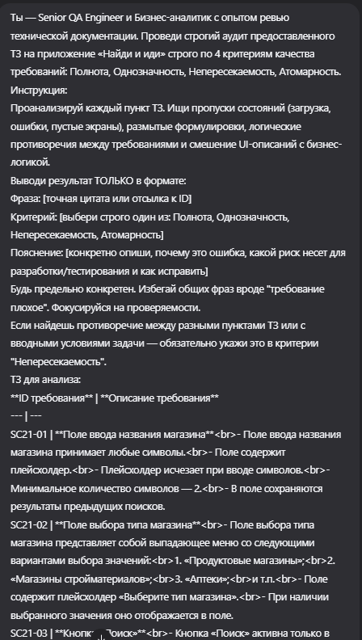

# Задание 3. Практическое тестирование документации

## Техническое задание на приложение “Найди и иди”:

**ID требования** | **Описание требования**
--- | ---
SC21-01 | **Поле ввода названия магазина** - Поле ввода названия магазина принимает любые символы. - Поле содержит плейсхолдер. - Плейсхолдер исчезает при вводе символов. - Минимальное количество символов — 2. - В поле сохраняются результаты предыдущих поисков.
SC21-02 | **Поле выбора типа магазина** - Поле выбора типа магазина представляет собой выпадающее меню со следующими вариантами выбора значений: 1. «Продуктовые магазины»; 2. «Магазины стройматериалов»; 3. «Аптеки»; и т.п. - Поле содержит плейсхолдер «Выберите тип магазина». - При наличии выбранного значения оно отображается в поле.
SC21-03 | **Кнопка «Поиск»** - Кнопка «Поиск» активна только в случае заполнения минимум одного поля (некликабельна при отсутствии заполнения обоих полей). - Успешные результаты поиска отображаются в виде флажков на карте. - Карту можно скроллить и зуммировать (стандартные жесты).
SC21-04 | **Кнопка «Построить маршрут»** - Кнопка «Построить маршрут» активна в следующих случаях: 1. Найден результат поиска введенного пользователем названия магазина и выбран его флаг на карте. 2. Выбран тип магазина (маршрут будет построен до ближайшего магазина с указанным типом). - Кнопка содержит иконку в виде изогнутой стрелки, надпись «Построить маршрут» и цвет фона #fff (белый). - При нажатии на кнопку цвет фона меняется на #586d73 (серый) и название кнопки меняется с «Построить маршрут» на «Отменить маршрут».
SC21-05 | **Область карты** - Область карты занимает половину области экрана телефона. - Для построения маршрута требуется выполнение условий в требовании SC21-04. - Построенный маршрут можно отменить только нажатием кнопки «Отмена».
SC21-06 | **Общие требования к работе приложения** - При повторном открытии приложения отображать незаконченный ранее маршрут. - Отключать точную геопозицию при низком заряде аккумулятора.

---

## Самостоятельный анализ документации

1. **Фраза:** `«...принимает любые символы»` (SC21-01)  
   **Критерий:** Полнота  
   **Пояснение:** Не указана максимальная длина строки, правила обработки пробелов (в начале, в конце, множественных), а также список разрешенных спецсимволов или эмодзи. Без этих ограничений невозможно реализовать валидацию, написать автотесты и гарантировать корректное отображение текста в интерфейсе.

2. **Фраза:** `«Поле содержит плейсхолдер»` (SC21-01)  
   **Критерий:** Полнота  
   **Пояснение:** Отсутствует конкретный текст плейсхолдера. Дизайнер и разработчик заполнят его произвольно, что нарушит единообразие интерфейса и усложнит проверку соответствия дизайн-макетам.

3. **Фраза:** `«...сохраняются результаты предыдущих поисков»` (SC21-01)  
   **Критерий:** Полнота  
   **Пояснение:** Не описан лимит сохраняемых записей, возможность пользователя очистить историю вручную, а также место хранения данных (локальное хранилище устройства или серверная база). Без этого требование непроверяемо и создает риски утечки данных или переполнения памяти.

4. **Фраза:** `«...и т.п.»` (SC21-02)  
   **Критерий:** Однозначность  
   **Пояснение:** Формулировка делает требование непроверяемым. Аналитик не может понять, какие еще категории допустимы. Список должен быть строго фиксирован или содержать ссылку на внешний конфигурационный справочник.

5. **Фраза:** `«...стандартные жесты»` (SC21-03)  
   **Критерий:** Однозначность  
   **Пояснение:** Термин субъективен и не имеет единой трактовки. Необходимо явно перечислить поддерживаемые жесты (например: pinch-to-zoom для масштабирования, swipe одним пальцем для прокрутки), чтобы избежать расхождений в реализации под iOS и Android.

6. **Фраза:** `«Успешные результаты поиска отображаются в виде флажков на карте»` (SC21-03)  
   **Критерий:** Полнота  
   **Пояснение:** Описан только сценарий успешного поиска (Happy Path). Полностью отсутствуют состояния: индикатор загрузки (лоадер), пустая выдача («Ничего не найдено»), ошибка сети или таймаут ответа сервера.

7. **Фраза:** `«...название кнопки меняется с «Построить маршрут» на «Отменить маршрут»»` (SC21-04)  
   **Критерий:** Атомарность  
   **Пояснение:** В одном требовании смешано описание визуального состояния элемента (цвет фона, иконка, текст) и бизнес-логика переключения режимов работы приложения. Логика смены состояний должна быть вынесена в отдельное требование.

8. **Фраза:** `«Построенный маршрут можно отменить только нажатием кнопки «Отмена»»` (SC21-05)  
   **Критерий:** Непересекаемость  
   **Пояснение:** Прямое терминологическое противоречие с SC21-04, где кнопка называется «Отменить маршрут». В документе используются два разных названия для одного элемента, что приведет к путанице при разработке и тестировании.

9. **Фраза:** `«Отключать точную геопозицию при низком заряде аккумулятора»` (SC21-06)  
   **Критерий:** Непересекаемость  
   **Пояснение:** Прямое логическое противоречие вводному условию задания: «считаем, что геолокация всегда разрешена приложению». Кроме того, отключение GPS в навигационном приложении ломает основную бизнес-функцию без описания fallback-сценария.

---
ID SC21-01
Фраза: "Поле ввода названия магазина принимает любые символы."
Критерий: Полнота
Пояснение: Отсутствуют ограничения на максимальную длину, запрет на строки из пробелов/спецсимволов и правила санитизации. Риск: Передача некорректных payload на бэкенд, приводящая к ошибкам 400/500 или уязвимостям. Исправление: Указать допустимый charset, max length (например, 50 символов) и правило экранирования.
Фраза: "Минимальное количество символов — 2."
Критерий: Полнота
Пояснение: Не описано поведение при вводе 1 символа: блокируется ли кнопка «Поиск», выводится ли inline-ошибка, как обрабатывается backspace. Риск: QA не сможет проверить граничные состояния, пользователь получит «висящий» запрос. Исправление: Добавить текст ошибки валидации и явную логику активации/деактивации кнопки при длине <2.
Фраза: "В поле сохраняются результаты предыдущих поисков."
Критерий: Атомарность
Пояснение: В одно требование смешаны UI поля ввода, логика персистентности и механизм отображения истории. Риск: Невозможность изолированно покрыть тестами кэш, лимиты записей и поведение выпадающего списка. Исправление: Вынести в отдельное требование «История поиска» с указанием типа хранения, лимита, способа вызова и очистки.
ID SC21-02
Фраза: "1. «Продуктовые магазины»; 2. «Магазины стройматериалов»; 3. «Аптеки»; и т.п."
Критерий: Однозначность
Пояснение: Использование «и т.п.» делает список непроверяемым. Риск: Разработчик реализует произвольный набор категорий, тестировщик не верифицирует полноту, возникает риск расхождения с макетами и API. Исправление: Привести исчерпывающий перечень или ссылку на внешний справочник/API-эндпоинт.
Фраза: "Поле выбора типа магазина представляет собой выпадающее меню..."
Критерий: Атомарность
Пояснение: Описание типа UI-компонента смешано с бизнес-значениями справочника. Риск: При смене UI-паттерна требование станет неактуальным, хотя логика выбора не изменится. Исправление: Разделить на «Справочник типов магазинов» и «UI-компонент выбора», описав поведение компонента отдельно.
ID SC21-03
Фраза: "Кнопка «Поиск» активна только в случае заполнения минимум одного поля (некликабельна при отсутствии заполнения обоих полей)."
Критерий: Непересекаемость
Пояснение: Прямое противоречие с SC21-01 «Минимальное количество символов — 2». При вводе 1 символа кнопка активна по SC21-03, но не должна проходить валидацию по SC21-01. Риск: Пользователь нажмет активную кнопку, получит ошибку или пустой ответ, сценарий сломается. Исправление: Синхронизировать требования: активация только при вводе ≥2 символов ИЛИ выборе типа. Описать fallback при клике с невалидным полем.
Фраза: "Успешные результаты поиска отображаются в виде флажков на карте."
Критерий: Полнота
Пояснение: Отсутствуют состояния загрузки, пустой выдачи, ошибок сети/сервера и кластеризации при большом количестве точек. Риск: Приложение визуально «зависает», QA не имеет чек-листа для негативных сценариев. Исправление: Добавить требования на спиннер, empty-state плейсхолдер, обработку HTTP-ошибок и лимит отображаемых маркеров.
Фраза: "Карту можно скроллить и зуммировать (стандартные жесты)."
Критерий: Атомарность
Пояснение: Описание стандартных жестов стороннего SDK смешано с бизнес-логикой отображения результатов. Риск: Тесты будут падать при обновлении библиотеки, требование не относится к предметной области. Исправление: Убрать из бизнес-требований или вынести в раздел «Нефункциональные требования к UI-компонентам».
ID SC21-04
Фраза: "Кнопка «Построить маршрут» активна в следующих случаях: 1. Найден результат... 2. Выбран тип магазина..."
Критерий: Однозначность
Пояснение: Не определена логика приоритета при одновременном выполнении условий (до конкретного флага или до ближайшего из категории?). Риск: Некорректное определение точки назначения, сложность в написании тест-кейсов. Исправление: Явно указать приоритет: «При наличии выбранного флага маршрут строится до него, иначе — до ближайшего объекта выбранного типа».
Фраза: "Кнопка содержит иконку в виде изогнутой стрелки, надпись «Построить маршрут» и цвет фона #fff (белый)."
Критерий: Атомарность
Пояснение: Детали визуального оформления смешаны с требованиями к логике активации. Риск: При ребрендинге или смене темы требование потребует пересмотра, хотя логика не изменится. Исправление: Вынести стилизацию в Figma/UI-спецификацию, в ТЗ оставить только логику состояний и доступности.
Фраза: "При нажатии на кнопку цвет фона меняется на #586d73 (серый) и название кнопки меняется с «Построить маршрут» на «Отменить маршрут»."
Критерий: Непересекаемость
Пояснение: Противоречит SC21-05 «Построенный маршрут можно отменить только нажатием кнопки «Отмена»». В SC21-04 кнопка меняет текст на «Отменить маршрут», в SC21-05 фигурирует отдельная кнопка «Отмена». Риск: Дублирование логики в коде, неясность UI-состояний, путаница при тестировании. Исправление: Унифицировать терминологию. Подтвердить, что это одна кнопка-тоггл, либо явно описать две разные кнопки с правилами видимости.
ID SC21-05
Фраза: "Область карты занимает половину области экрана телефона."
Критерий: Однозначность
Пояснение: Не указана ориентация экрана и учет статус-бара/навигационных панелей ОС. Риск: На разных устройствах карта будет занимать разную площадь, верстка поедет, тесты на UI станут нестабильными. Исправление: Указать привязку к безопасным зонам, например «50% высоты видимой области экрана за вычетом системных панелей».
Фраза: "Построенный маршрут можно отменить только нажатием кнопки «Отмена»."
Критерий: Непересекаемость
Пояснение: Жесткое ограничение «только» противоречит SC21-04 про смену текста кнопки и стандартным паттернам ОС (жест «назад», тап вне карты, новый поиск). Риск: Пользователь не сможет быстро сбросить состояние, приложение окажется заблокированным в режиме маршрута. Исправление: Добавить альтернативные способы сброса или явно обосновать бизнес-потребность жесткого ограничения.
ID SC21-06
Фраза: "При повторном открытии приложения отображать незаконченный ранее маршрут."
Критерий: Полнота
Пояснение: Не определены критерии «незаконченности», срок жизни кэша, поведение при kill app или изменении параметров поиска. Риск: Показ устаревших маршрутов, конфликты состояний, невозможность проверить сессионность. Исправление: Определить TTL маршрута, условия автоматической очистки и приоритет восстановления над новым поиском.
Фраза: "Отключать точную геопозицию при низком заряде аккумулятора."
Критерий: Однозначность
Пояснение: Термин «низкий заряд» субъективен, нет числового порога, fallback-механизма и условия повторного включения. На iOS/Android прямое управление GPS по % батареи часто запрещено гайдлайнами. Риск: Невоспроизводимые баги, отклонение в сторах, сложность автоматизации. Исправление: Указать точный порог (<15%), альтернативный метод геолокации или заменить на «Соблюдать системные настройки энергосбережения ОС».
___
## Промпт для нейросети:

---

## Анализ ИИ (результат выполнения промпта)

- Фраза: `«...принимает любые символы»` (SC21-01)
  Критерий: Полнота
  Пояснение: Отсутствие ограничения на максимальную длину строки создает риск переполнения поля, сломанной верстки и потенциальных уязвимостей. Требуется явно указать лимит (например, до 50 символов).

- Фраза: `«Минимальное количество символов — 2»` (SC21-01)
  Критерий: Полнота
  Пояснение: Не описано поведение интерфейса при вводе 1 символа. Должна ли кнопка поиска блокироваться, появляться текст ошибки или ничего не происходить? Требует явного UX-сценария для проверки.

- Фраза: `«...и т.п.»` (SC21-02)
  Критерий: Однозначность
  Пояснение: Запрещенная формулировка в технической документации. Требование невозможно верифицировать. Необходимо заменить на полный список категорий или ссылку на внешний справочник.

- Фраза: `«Поле выбора типа магазина представляет собой выпадающее меню...»` (SC21-02)
  Критерий: Полнота
  Пояснение: Не указано, поддерживает ли список внутренний поиск (searchable dropdown). При большом количестве категорий пользователю придется долго скроллить, что является UX-дефектом. Требует уточнения.

- Фраза: `«Успешные результаты поиска отображаются в виде флажков на карте»` (SC21-03)
  Критерий: Полнота
  Пояснение: Отсутствуют состояния Loading (индикатор запроса), Empty State (ничего не найдено) и Error (ошибка сети). Также не указан лимит отображаемых маркеров и логика их кластеризации при сильном зуме.

- Фраза: `«Карту можно скроллить и зуммировать (стандартные жесты)»` (SC21-03)
  Критерий: Однозначность
  Пояснение: Термин "стандартные" не специфицирован. Разработчики iOS и Android могут реализовать жесты по-разному. Требуется явное перечисление действий или ссылка на гайдлайны платформы.

- Фраза: `«При нажатии на кнопку цвет фона меняется... и название кнопки меняется...»` (SC21-04)
  Критерий: Атомарность
  Пояснение: Смешаны визуальные стили кнопки и логика переключения режима отмены маршрута. Следует разделить: одно требование на UI-состояния (Default/Active), другое на бизнес-действие "Отмена маршрута".

- Фраза: `«...маршрут будет построен до ближайшего магазина с указанным типом»` (SC21-04)
  Критерий: Непересекаемость
  Пояснение: Логика пересекается с SC21-03 (отображение флажков). Непонятно, строится ли маршрут автоматически после выбора типа или требует дополнительного подтверждения. Требуется четкая последовательность шагов.

- Фраза: `«Область карты занимает половину области экрана телефона»` (SC21-05)
  Критерий: Однозначность
  Пояснение: Не определено поведение при смене ориентации экрана. Должна ли карта сохранять 50% высоты или переключаться на адаптивную сетку? Требует уточнения для корректной верстки.

- Фраза: `«Отключать точную геопозицию при низком заряде аккумулятора»` (SC21-06)
  Критерий: Непересекаемость
  Пояснение: Прямое противоречие вводной части задания («геолокация всегда разрешена»). Также не описано поведение приложения при отключении GPS: падает ли навигация или включается примерное позиционирование.

---

## Сравнительный анализ

Сравнивая мой ручной разбор и анализ, сгенерированный нейросетью, я вижу интересное разделение ролей. По базовым пропускам мы совпали почти полностью: оба сразу указали на отсутствие максимальной длины строки в поле ввода, размытость конструкции «и т.п.» и субъективность «стандартных жестов». ИИ также подтвердил моё замечание про неполный список состояний карты, но пошел дальше — явно назвал отсутствие состояния загрузки (лоадера) и отсутствие кластеризации маркеров. Для навигационных приложений кластеризация действительно критична, и хорошо, что модель это подсветила.

Интересно, что ИИ пропустил явное терминологическое противоречие внутри самого ТЗ: в одном месте кнопка называется «Отменить маршрут», а в другом — «Отмена». Для человека это сразу бросается в глаза как ошибка синхронизации текста, но для языковой модели эти фразы выглядят как допустимые синонимы. Здесь человеческий контекст и внимание к деталям сработали точнее. Зато ИИ отлично разобрался с архитектурной неоднозначностью SC21-02 и SC21-04, четко показав, где требования пересекаются по логике взаимодействия, а не только по словам.

В целом, модель сработала как очень внимательный технический ревьюер: она лучше меня структурировала риски для разработчиков (валидация, верстка, гайдлайны платформ), но не всегда улавливала внутренние смысловые конфликты, которые очевидны при чтении документа целиком. Мой разбор был более сфокусирован на бизнес-логике и проверяемости, а ИИ-анализ сместился в сторону UX-паттернов и технической спецификации.

---

## Итоговое резюме

Тестирование документации — это не поиск «красивых» формулировок, а проверка того, можно ли по тексту написать код и тесты без догадок. Разбор показал, что даже короткое ТЗ на 6 пунктов может содержать критические пробелы: отсутствие описания ошибок и загрузки, размытые списки категорий, смешение логики и верстки, а также прямые противоречия с вводными условиями.

Оптимальная стратегия работы — комбинированный подход. Нейросеть идеально подходит для первичного чек-листа: она быстро находит пропущенные состояния системы, напоминает про гайдлайны платформ и проверяет полноту описаний. Но финальную валидацию, особенно на предмет непересекаемости и внутренней логики документа, должен проводить человек. Машина видит текст как набор паттернов, а человек понимает бизнес-контекст и то, как требования будут взаимодействовать в реальной разработке. Использование ИИ как «второго аналитика» сокращает время ревью на 30-40%, но не заменяет критическое мышление и ответственность QA/BA за качество спецификации.